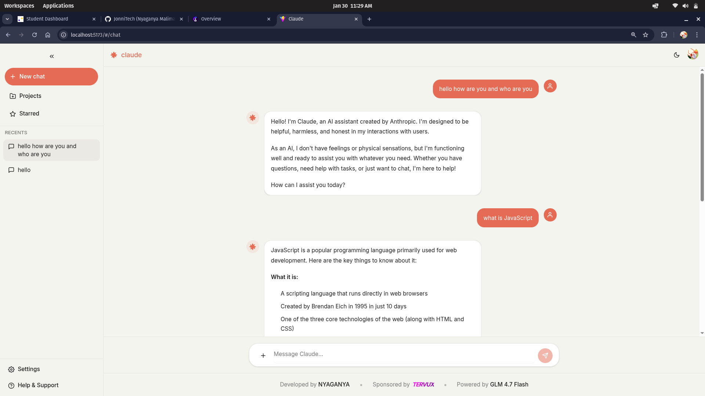
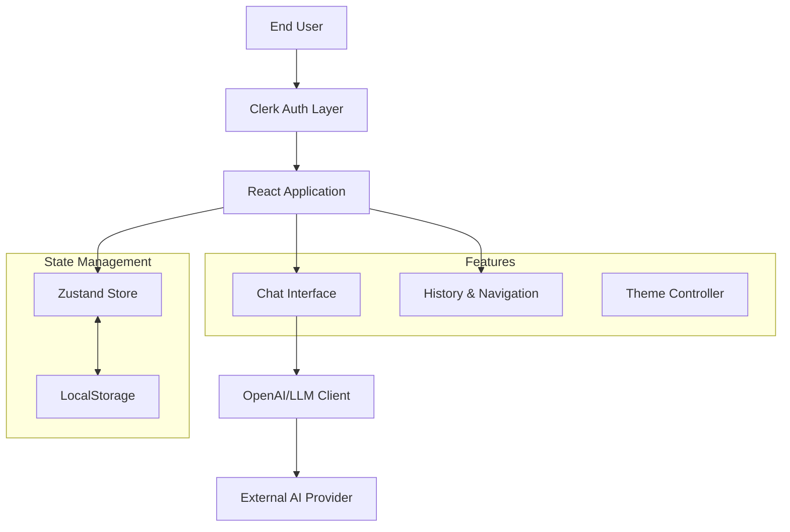
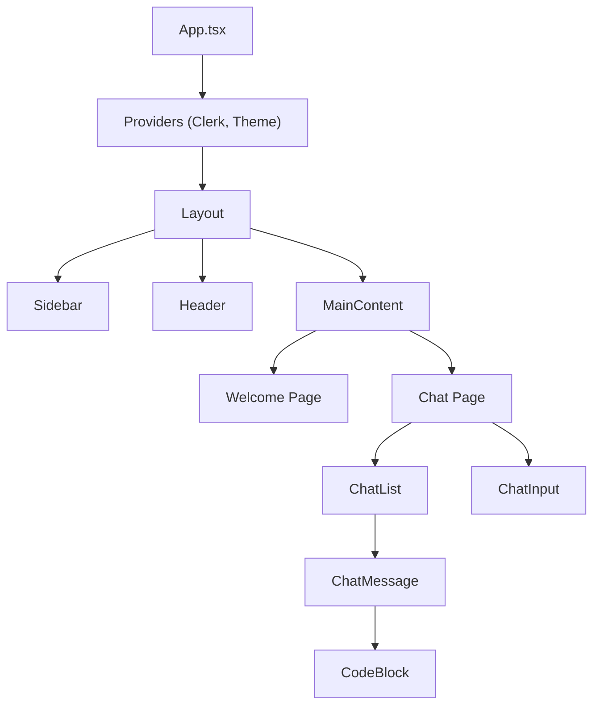

# Claude AI Clone — Engineering & Design Showcase


An advanced, pixel-perfect recreation of the Claude AI web interface. This project demonstrates **production-grade frontend engineering**, **complex state management**, and **high-fidelity UX design** capabilities. It is built to serve as a portfolio piece showcasing mastery of modern web technologies.



---

## Table of Contents

1.  [Purpose & Goal](#purpose--goal)
2.  [Problem Statement](#problem-statement)
3.  [Solution & Approach](#solution--approach)
4.  [Why Hire Me?](#why-hire-me)
5.  [Technical Architecture](#technical-architecture)
6.  [Key Features](#key-features)
7.  [Project Structure](#project-structure)
8.  [Getting Started](#getting-started)

---

## Purpose & Goal

The primary goal of this project was to reverse-engineer a complex, high-traffic SaaS application (Claude AI) to demonstrate the ability to build professional-grade software. It goes beyond a simple tutorial project by implementing:
*   **Real-time data streaming** for chat interfaces.
*   **Robust authentication flows** ensuring secure access.
*   **Persistent local state** for seamless user sessions.
*   **Responsive, accessible design** that works across devices.

---

## Problem Statement

Building a modern AI chat interface presents several engineering challenges that this project addresses:

*   **Complex State Synchronization**: Managing chat history, loading states, and user sessions without performance degradation.
*   **Real-Time UX**: Rendering streaming text tokens smoothly while parsing Markdown and code blocks on the fly.
*   **Design Consistency**: Maintaining strict adherence to a specific design system (colors, typography, spacing) across light and dark modes.
*   **Secure Integration**: Handling API keys and user authentication securely in a client-side application.

---

## Solution & Approach

I engineered a solution leveraging a **modern React tech stack** to solve these problems efficiently.

| Challenge | Technical Solution |
| :--- | :--- |
| **State Management** | **Zustand** with persistence middleware. Chosen over Context API for better performance (selector-based re-renders) and simpler boilerplate than Redux. |
| **Styling & Theming** | **Tailwind CSS v4** with CSS variables. This allows instant dark/light mode switching and centralized management of Claude's unique "Terracotta" and "Cream" color palette. |
| **Performance** | **Vite** for HMR and optimized production builds. React 19's concurrent features ensure the UI remains responsive even during heavy rendering tasks. |
| **Authentication** | **Clerk** integration. Offloaded complex identity management (OAuth, Sessions) to a dedicated provider to focus on core product value. |
| **Type Safety** | **Strict TypeScript**. Ensures maintainability and catches errors at build time, crucial for scaling a codebase. |

---

## Why Hire Me?

This project is a direct reflection of the skills I bring to an engineering team:

#### 1. Attention to Detail (UI/UX)
I didn't just copy the layout; I replicated the *feel* of the application.
*   **Typography**: Implemented the **Inter** font family with precise tracking and leading.
*   **Micro-interactions**: Hover states, transition timings, and the specific "pill-shape" border radius of buttons match the source material exactly.
*   **Theming**: Implemented a robust CSS variable system for pixel-perfect Dark Mode support.

#### 2. Modern Stack Proficiency
I realized this project using the latest industry-standard tools (**React 19**, **TypeScript**, **Tailwind**, **Vite**). I am comfortable efficiently navigating and utilizing the modern JavaScript ecosystem.

#### 3. Architectural Thinking
I structured the application for scalability. Separation of concerns is evident in the folder structure:
*   `hooks/`: Encapsulated logic (e.g., `useChat`).
*   `lib/`: Pure utility functions and API clients.
*   `components/`: Reusable, presentation-focused UI elements.
*   `store/`: Centralized state management.

#### 4. Problem Solving
When faced with API integration challenges (handling missing keys gracefully), I implemented robust fallback mechanisms (mock responses) to ensure the UI remains testable and demonstratable even without live credentials.

---

## Technical Architecture

### System Design
The application follows a clean **Client-Side SPA (Single Page Application)** architecture.



### Component Hierarchy
The UI is broken down into atomic, reusable components.



---

## Key Features

### Intelligent Chat Interface
*   **Streaming Responses**: Real-time token rendering for a lively AI feel.
*   **Rich Text Rendering**: `react-markdown` integration to render bold text, lists, and tables.
*   **Code Highlighting**: Syntax highlighting for code blocks supporting multiple languages.

### Authentic Design System
*   **Claude Theme**: Custom Tailwind configuration for the signature `#D97757` (Terracotta) and `#F4F3EE` (Cream) colors.
*   **Fluid Animations**: `framer-motion` used for smooth sidebar transitions and loading indicators.
*   **Responsive Layout**: Mobile-first approach with a collapsible sidebar and adaptive typography.

### Secure & Persistent
*   **User Sessions**: Secure login/logout flows via Clerk.
*   **History Persistence**: Chat history is automatically saved to LocalStorage, allowing users to pick up where they left off.

---

## Project Structure

A brief overview of the codebase organization:

```
src/
├── components/          # React Components
│   ├── ui/              # Generic UI Primitives (Button, Input)
│   ├── ChatMessage.tsx  # Message bubble logic
│   ├── CodeBlock.tsx    # Syntax highlighting wrapper
│   └── ClaudeLogo.tsx   # Custom SVG iconography
├── hooks/               # Custom Hooks
│   └── useChat.ts       # Chat logic controller
├── lib/                 # Utilities
│   ├── openai.ts        # API Client configuration
│   └── store.ts         # Global State (Zustand)
├── pages/               # Route Views
│   ├── Welcome.tsx      # Landing page
│   └── Chat.tsx         # Main application view
└── App.tsx              # Root component & Routing
```

---

## Getting Started

To run this project locally:

1.  **Clone the Repo**
    ```bash
    git clone https://github.com/JonniTech/Claude-Clone.git
    cd Claude-Clone
    ```

2.  **Install Dependencies**
    ```bash
    npm install
    # or yarn install
    ```

3.  **Environment Setup**
    Create a `.env` file in the root:
    ```env
    VITE_CLERK_PUBLISHABLE_KEY=your_clerk_key
    VITE_ZAI_API_KEY=your_openai_compatible_key
    ```

4.  **Run Dev Server**
    ```bash
    npm run dev
    ```

---

**Ready to build something amazing?**
This project represents just a fraction of what I can build. I am available for full-time Front-End or Full-Stack engineering roles.
